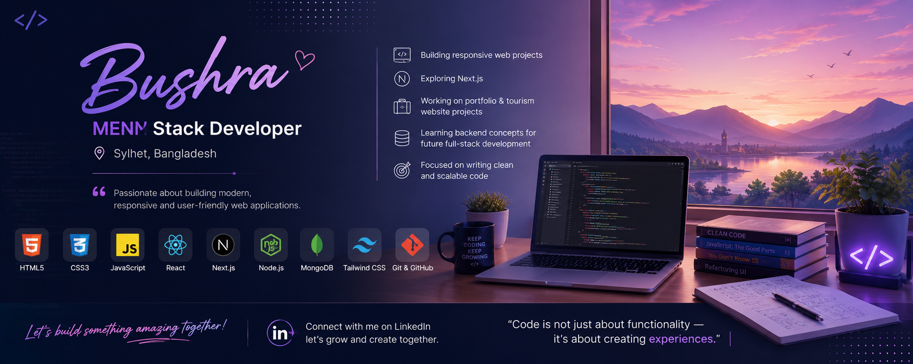

<h1 align="center">Hi 👋, I'm Bushra</h1>

<h3 align="center">
🚀 Full Stack Developer | MERN Stack Developer
</h3>

<p align="center">
📍 Sylhet, Bangladesh <br>
💻 Passionate about building scalable, modern & user-friendly web applications
</p>

<p align="center">
<a href="https://www.linkedin.com/in/nusrat-tasmin-bushra/">

</a>
</p>

---

## 👩‍💻 About Me

Hello! I'm **Bushra**, a passionate **Full Stack Developer** who loves creating modern web applications with clean UI, efficient backend systems, and scalable architecture.

I enjoy transforming ideas into real-world digital solutions by combining strong frontend experiences with powerful backend technologies.

### 🚀 What I Do

- 🔥 Build responsive and interactive web applications
- 🎨 Create modern UI/UX experiences
- ⚡ Develop scalable backend APIs
- 🗄️ Design and manage databases
- 🔐 Implement secure authentication systems
- 🚀 Continuously learning and improving full-stack development skills

---

## 🛠️ Tech Stack

### 🎨 Frontend Development

<p align="center">


</p>


### ⚙️ Backend Development

<p align="center">


</p>


### 🗄️ Database & Authentication

<p align="center">


</p>

<p align="center">


</p>


### 🔧 Tools & Others

<p align="center">


</p>

---

# 🚀 My Development Journey

```
Frontend
   ↓
HTML
CSS
Tailwind CSS
JavaScript
React.js
Next.js

   ↓

Backend
   ↓
Node.js
Express.js

   ↓

Database
   ↓
MongoDB

   ↓

Authentication
   ↓
JWT
Better Auth
```

---

# 💼 Featured Skills

<table>
<tr>
<td width="50%">

### Frontend

✔ Responsive Web Design  
✔ Component-Based Architecture  
✔ React Hooks  
✔ Next.js Routing  
✔ Modern UI Development  
✔ Tailwind CSS Styling  

</td>

<td width="50%">

### Backend

✔ REST API Development  
✔ Express.js Server  
✔ Database Management  
✔ Authentication Systems  
✔ Secure API Integration  
✔ Full Stack Deployment  

</td>
</tr>
</table>

---

# 📌 Current Focus

🌱 Improving advanced **Next.js architecture**

🔥 Building full-stack production-ready applications

🔐 Learning advanced authentication & security

⚡ Improving backend performance

📚 Exploring modern web development practices

---

# 📊 GitHub Statistics

<p align="center">


</p>


<p align="center">


</p>


<p align="center">


</p>

---

# 🌐 Connect With Me

<p align="center">

<a href="https://www.linkedin.com/in/nusrat-tasmin-bushra/">


</a>

</p>

---

# 💡 Developer Mindset

<p align="center">

*"Great software is not only about writing code.  
It's about solving problems and creating meaningful experiences."*

</p>

---

<p align="center">

⭐ Thanks for visiting my GitHub profile ⭐

</p>
